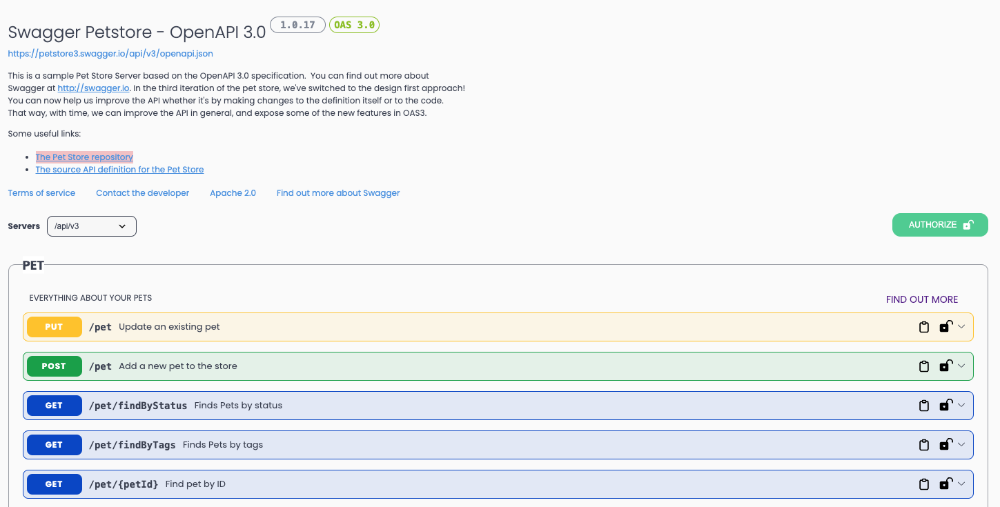
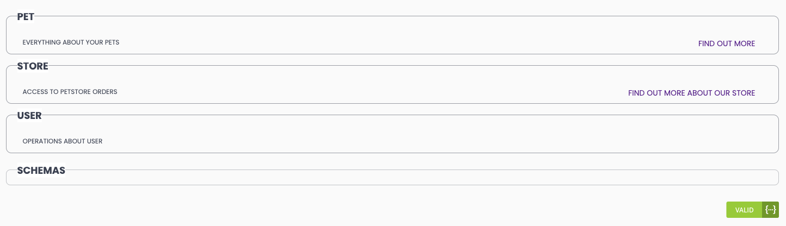

# Swagger UI Improved Theme

Another attempt to make swagger ui docs look cool. Checkout the screen shots.

##### Note

- Theme works fine for openapi v3+.
- Theme works OK for swagger v2 (not completed tested but most of the things should work fine).
- In future, only v3+ will be supported (if some change in openapi spec breaks v2 theme, then it will not be handled).

# How to Use?

- Download the CSS file locally and use in your project.
- Use a CDN - jsDelivr. Just copy below URL -

```
  https://cdn.jsdelivr.net/gh/ajatkj/swagger-ui-improved-theme/css/swagger-ui-improved.css
```

# Screenshots





##### TODO

- Custom CSS properties to change colors, svgs, border-radius, etc. for ease of use.
- When above is done, add add-on CSS files to support various themes.
- Probably add js for further changes to the look and feel of swagger UI.
- Add contribution guide to the project.
